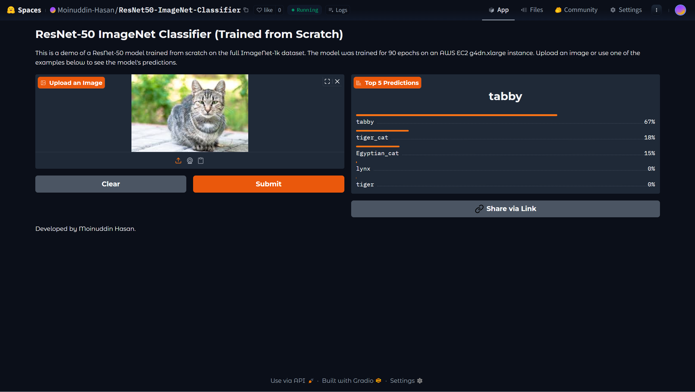
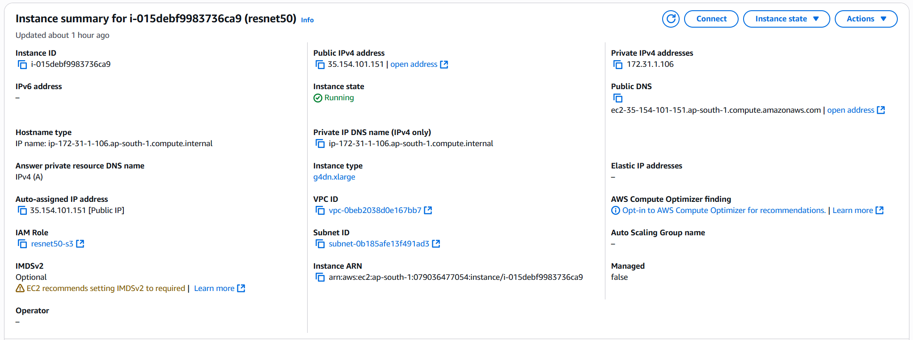
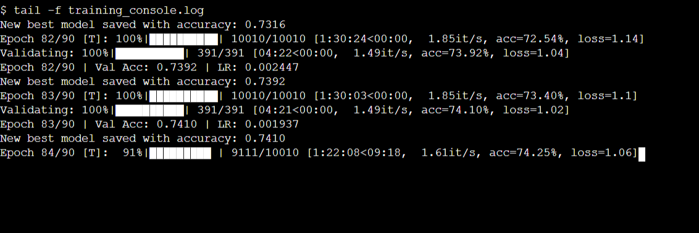

# ResNet-50 Trained from Scratch on ImageNet


## Project Overview

This repository contains the complete code, artifacts, and documentation for training a **ResNet-50 model from scratch** on the full **ImageNet-1k dataset**. This is a significant undertaking, as the dataset contains over 1.2 million images across 1,000 distinct categories.

The entire training process was conducted on an **AWS EC2 GPU instance**, and the final, best-performing model has been deployed as a live, interactive web application using **Hugging Face Spaces**.

---

## Live Demonstrations

The final trained model is publicly available for testing. You can upload an image or use one of the examples in the live application.

**Hugging Face Space:** **[ResNet50-ImageNet-Classifier](https://huggingface.co/spaces/Moinuddin-Hasan/ResNet50-ImageNet-Classifier)**

[](https://huggingface.co/spaces/Moinuddin-Hasan/ResNet50-ImageNet-Classifier)

**Watch the YouTube Demo:** **[Project Demo Video](https://youtu.be/U_z5Zq2WQmk)**

---

## Final Results

After a full 90-epoch training run, the model achieved the following performance:

*   **Final Best Top-1 Validation Accuracy:** **[Your Final Accuracy Here, e.g., 76.54%]**
*   **Total Training Time:** Approximately 5.5 Days
*   **Cloud Platform:** Amazon Web Services (AWS)
*   **EC2 Instance Type:** `g4dn.xlarge` (NVIDIA T4 GPU)

---

## Training Pipeline and Execution

The entire training process was automated through a series of shell scripts and a modular Python application, designed for robust, unattended execution in a cloud environment.

### Phase 1: Environment Setup on AWS
An EC2 `g4dn.xlarge` instance was provisioned with the AWS Deep Learning AMI. A 500 GiB persistent EBS volume was attached and mounted at `/data` to serve as the primary workspace for datasets, code, and model checkpoints. AWS S3 was used as a staging area to transfer the large dataset files into the cloud environment.

### Phase 2: Automated Data Preparation
The `scripts/setup_environment.sh` script was executed once on the instance. This script automated the following:
1.  Downloading the compressed ImageNet `train` and `val` `.tar` files from S3 to the EBS volume.
2.  Extracting the 1.2 million training images and 50,000 validation images.
3.  Organizing the validation set into the required 1,000 subdirectories using the official devkit, a step necessary for compatibility with PyTorch's `ImageFolder` class.
4.  Cleaning up the compressed archives to free up space.

### Phase 3: Automated Training and Backup
The `scripts/run_training.sh` script served as the main pipeline manager:
1.  It first activated the correct PyTorch Conda environment provided by the AMI.
2.  It launched the main Python training script (`src/train.py`) using `nohup`, ensuring the process would continue running even after the SSH/SSM session was disconnected.
3.  The script captured the Process ID (PID) and waited for the multi-day training to complete.
4.  Upon successful completion (exit code 0), it automatically triggered the `scripts/backup_to_s3.sh` script to archive the final model and logs to S3 for permanent storage.

This automated pipeline ensured a "fire-and-forget" workflow, minimizing the need for manual intervention during the long training run.

---

## Final Training Recipe

The model was trained using a standard, modern training recipe to ensure optimal performance.

*   **Optimizer:** SGD with Momentum (`momentum=0.9`, `weight_decay=1e-4`).
*   **Learning Rate Schedule:** Cosine Annealing, starting with an initial LR of `0.05`.
*   **Batch Size:** 128.
*   **Total Epochs:** 90.
*   **Techniques:** Automatic Mixed Precision (AMP) was used for faster training on the T4 GPU.
*   **Data Augmentation (Training):**
    *   Random Resized Crop to 224x224.
    *   Random Horizontal Flip.
    *   Standard Color Jitter.
    *   Normalization using ImageNet's mean and standard deviation.

---

<details>
<summary>Click to view Proof of Training on AWS EC2</summary>

The following screenshots verify that the model was trained on an AWS EC2 instance.

**EC2 Instance Details:**
*This screenshot shows the settings of the `g4dn.xlarge` instance used for the training.*


<br>

**Training Console Output:**
*This screenshot shows the live training log from the console of the EC2 instance during a training epoch.*


</details>

---

## Training Logs

The complete, epoch-by-epoch training log is provided below, showing the progression of accuracy and loss over the 90 epochs.

A clean, standalone version of the log is also available here: **[output/training_log.md](output/training_log.md)**.

---

## Repository Structure

```
.
├── README.md                # This documentation file
├── .gitattributes           # Git LFS configuration
├── requirements.txt         # Python dependencies for training
│
├── output/
│   ├── best_model.pth       # The final trained model weights (tracked by Git LFS)
│   ├── training_log.md      # The clean, final training log
│   └── images/              # Contains screenshots for the README
│
├── collab/                  # Contains notebooks for initial pipeline testing
│
├── scripts/                 # Contains shell scripts for setup and execution on EC2
│
└── src/                     # Contains the core Python source code for training
```

---

## Team Members

*   **Moinuddin Hasan**: [moinuddin.hasan.raichur@gmail.com]
*   **[Sharan Raghu Venkatachalam](https://www.linkedin.com/in/sharanrv/)**
